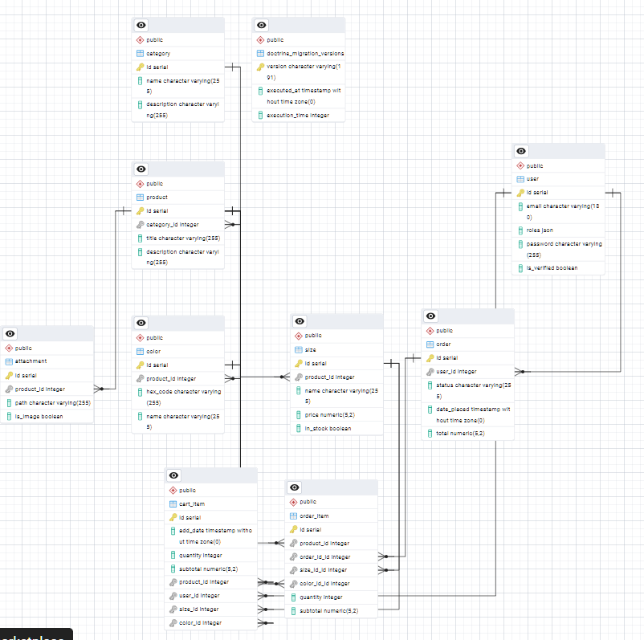

# INSTRUCTION
Avant de commencer, assurez-vous d'avoir les éléments suivants installés sur votre machine :

- **PHP** 8.2.12 ou supérieur
- **Composer** 
- **PostgreSQL** 
- **Symfony CLI** 
- **Git** (pour cloner le dépôt)
- **OpenSSL** (pour générer les clés JWT)
  
  ## Étapes d'Installation
   1. Cloner le projet
       ```bash
       git clone https://github.com/izzm-vp/symfony-marketplace-backend.git
       cd symfony-marketplace-backend
       ````
   2. Installer les dépendances PHP
       ```bash
       composer install
       ````
   3. Configurer l'environnement
      
        Le fichier .env.example liste les variables requises;
        copiez-le en .env et remplissez-le avec vos propres valeurs.
      
  4. Génération des clés JWT (OpenSSL)
      
        Crée un nouveau dossier dans le dossie config;
        exécutez la commande suivante pour générer les clés secrètes et publiques pour JWT
                      
     
                 # Génère une clé privée (avec passphrase)
                 openssl genpkey -out config/jwt/private.pem -aes256 -algorithm rsa -pkeyopt rsa_keygen_bits:4096
                 # Génère la clé publique correspondante
                 openssl pkey -in config/jwt/private.pem -out config/jwt/public.pem -pubout
  
                            ````
       Vous devrez entrer une passphrase (mot de passe) pour la clé privée;
             Ajoutez cette passphrase dans .env pour la variable **JWT_PASSPHRASE**
     
  6. Créer la base de données
      ```bash
       php bin/console doctrine:database:create
       ````
      
  7. Exécuter les migrations
      ```bash
      php bin/console doctrine:migrations:migrate
       ````
 8. Exécuter le serveur de développement Symfony
      ```bash
      symfony server:start
       ````
 9. tester le backend en clonant le dépôt du frontend (react-marketplace-frontend) et en l'exécutant avec succès.

     
## Modèle Logique de Données
  


   
                      
     
     

             
  

      
 
